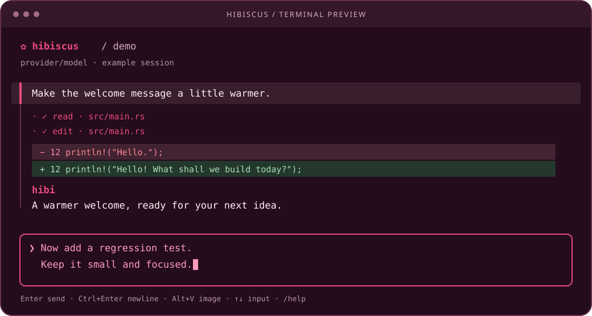

<p align="center">
  
</p>

<h1 align="center">hibiscus</h1>

<p align="center">
  <strong>Your terminal, in bloom.</strong><br>
  A focused Rust CLI for the <a href="https://pi.dev">Pi</a> coding agent.
</p>

<p align="center">
  <a href="https://github.com/Rekabytes-Enterprise/hibiscus/releases/latest"></a>
  <a href="https://github.com/Rekabytes-Enterprise/hibiscus/actions/workflows/ci.yml?query=branch%3Adev"></a>
  <a href="https://github.com/Rekabytes-Enterprise/hibiscus/releases"></a>
  <a href="docs/installation.md"></a>
</p>

<p align="center">
  <a href="#quick-start">Quick start</a> ·
  <a href="#made-for-the-terminal">Features</a> ·
  <a href="#your-everyday-commands">Commands</a> ·
  <a href="docs/README.md">Documentation</a> ·
  <a href="CONTRIBUTING.md">Contribute</a> ·
  <a href="LICENSE">MIT license</a>
</p>

<p align="center">
  
  <br><sub>Illustrated preview with sample content. Colors and key hints depend on your terminal.</sub>
</p>

Chat, switch models, pick up an earlier session, and share screenshots—without leaving your terminal. Hibiscus brings a calm, raspberry-pink interface; **Pi handles the intelligence**: models, authentication, tools, agent runs, and saved sessions.

<sub>The download badge updates automatically through Shields.io. It counts GitHub release asset downloads across releases, including checksum files—not unique users, source clones, or Cargo installations. Counts may be cached.</sub>

## Quick start

**Linux, WSL, and macOS · x86-64 and ARM64**

```sh
curl -fsSL https://raw.githubusercontent.com/Rekabytes-Enterprise/hibiscus/main/install.sh | sh
```

Then start a conversation:

```sh
hibiscus
```

Use `/login` if you need to sign in, then `/models` to choose a model available to your Pi configuration.

The installer verifies release checksums and places Hibiscus in `~/.local/bin`. It reuses an existing Pi installation or installs Pi if missing. Pi needs **Node.js 22.19+**; its installer may offer to install Node and may ask for elevated permissions. Hibiscus itself does not require Rust or `sudo` for a prebuilt install.

Prefer to inspect the installer first, choose a version, or use a custom directory? See [installation options](docs/installation.md).

## Made for the terminal

| | What you get |
| :--- | :--- |
| **Clear conversations** | Ubuntu-style aubergine background, lighter user rows, visible `hibi` reply headings, Markdown, and a scrolling transcript. |
| **Room to think** | A movable insertion cursor in a multiline composer that grows to five rows, then scrolls within the input. |
| **Show, don't describe** | Paste clipboard images alongside your prompt, with a visible attachment count. |
| **Models at your fingertips** | A keyboard-and-wheel picker of Pi-configured models, grouped by provider. |
| **Pick up where you left off** | Resume the latest session or choose another, with recent conversation context shown. |
| **Know what's happening** | Live phase on the footer's left, optional checklist Goal bar on its right; a small rotating Exploring glyph beside the latest file, checked read/bash counts, visible failures, and individual edit diffs in chat. |
| **Stay in control** | Type while Pi works: Enter steers, Ctrl+Q (WSL) or Alt+Enter queues a follow-up. Waiting messages stay beside the composer until Pi actually delivers them; dangerous shell commands request approval in the same docked panel style as `/models`. Esc clears the queue and stops a run. |

### A few keys to remember

| Action | Shortcut |
| :--- | :--- |
| Send / steer during a run | **Enter** |
| Queue a follow-up during a run | **Ctrl+Q on WSL** · **Alt+Enter elsewhere** |
| Newline | **Ctrl+Enter** · Ctrl+J fallback |
| Paste an image | **Alt+V on WSL** · **Ctrl+V elsewhere** |
| Remove staged images | **Ctrl+X** |
| Move/edit inside a draft | **← / → / ↑ / ↓**, Home/End, Backspace/Delete |
| Scroll a long draft | Wheel over the input |
| Scroll the conversation | **PgUp / PgDn** or mouse wheel |
| Stop the current run | **Esc** |

Image paste needs a supported local clipboard backend and an image-capable model. Input editing currently appends or deletes at the end of the draft. See [terminal behavior](docs/terminal.md) for clipboard requirements, limits, and terminal-specific shortcuts.

## Your everyday commands

```sh
hibiscus                              # open a new chat
hibiscus --continue                   # resume the latest session here
hibiscus --sessions                   # choose a saved session
hibiscus "Explain this repository"     # run a one-shot prompt
printf 'Hello\nFollow up\n' | hibiscus   # pipe a conversation
```

Inside a chat:

| Command | What it does |
| :--- | :--- |
| `/new` | Open a blank chat while keeping previous sessions saved |
| `/continue` | Resume the latest saved session in this directory |
| `/sessions` | Choose and switch sessions |
| `/models` | Choose a model across Pi-configured providers |
| `/login` | Sign in with Codex, or hand off to Pi for another provider |
| `/logout` | Choose a provider and remove its stored credential inside Hibiscus |
| `/restore` | Restore a failed prompt and images for review, without sending |
| `/reconnect` | Reconnect a disconnected Pi backend without replaying requests |
| `/help` | Show available commands |
| `/quit` or `/exit` | Leave Hibiscus |

Sessions belong to Pi, not a second Hibiscus database. On resume, Hibiscus shows up to the **last five user turns** and their replies; Pi retains the full history. One-shot prompts are saved as separate sessions.

Model errors should not end your chat. Hibiscus keeps the UI open after rate limits, authentication/subscription failures, and rejected commands. Pi manages retries; `/restore` lets you review a failed prompt, while `/reconnect` handles a lost backend without automatically resending anything. [Recovery guide →](docs/error-handling.md)

## Keep it fresh

```sh
hibiscus update
hibiscus --version
```

Prebuilt installs can update from GitHub Releases with checksum verification and atomic replacement. Restart after updating. Full-screen chat also checks for updates at most once a day and offers **Later / Update now**; offline checks don't block chat.

Set `HIBISCUS_NO_UPDATE_CHECK=1` to disable automatic checks. Custom install directories need `HIBISCUS_INSTALL_DIR`; source/Cargo installations should be updated with `cargo install --path .` instead. [More about updates →](docs/installation.md)

## Hibiscus + Pi

**A terminal interface, not another agent.** Hibiscus controls a long-lived `pi --mode rpc` process over JSONL. Pi remains responsible for authentication, model access, tools, agent behavior, and session persistence.

- Hibiscus launches Pi with **installed extensions disabled**, its one explicit approval gate, and the built-in **read, bash, edit, and write** tools enabled. Your normal standalone Pi configuration is unaffected.
- Codex sign-in and provider logout stay inside full-screen Hibiscus with the Pi SDK available. Logout asks for a provider and confirmation; it removes only that stored credential, not environment/config keys or provider-side access. Other-provider login hands off to Pi's TUI; `/quit` there returns to Hibiscus. [Authentication details →](docs/terminal.md#authentication-handoff)
- `NO_COLOR=1` disables colors. Small terminals, `TERM=dumb`, and piped input use line mode.
- Set `HIBISCUS_PI` to select a different Pi executable. Pi's session-directory settings are respected.

## Build & contribute

With [Pi](https://pi.dev), Rust, Cargo, and a C linker installed:

```sh
git clone https://github.com/Rekabytes-Enterprise/hibiscus.git
cd hibiscus
cargo test --locked
cargo install --path .
```

On Ubuntu/WSL, the linker prerequisite is `sudo apt install build-essential`. Source builds require Pi separately; the prebuilt installer handles Pi installation for you. To contribute, [fork the repository, branch from `dev`, and open a PR targeting `dev`](CONTRIBUTING.md#fork-branch-and-open-a-pull-request), not `main`.

| Explore | |
| :--- | :--- |
| [Changelog](CHANGELOG.md) | What's new in each version |
| [Installation & releases](docs/installation.md) | Platforms, installer options, updates, and publishing |
| [Terminal guide](docs/terminal.md) | Input, images, sessions, authentication, and compatibility |
| [Architecture](docs/architecture.md) | The Rust modules and Pi RPC boundary |
| [Development](docs/development.md) | Tests and manual verification |
| [Contributing](CONTRIBUTING.md) | Fork, branch, and submit a PR to `dev` |
| [MIT license](LICENSE) | Use, modify, redistribute, and sell copies under the MIT terms |

## Ownership and license

Hibiscus is a project of [Reka Bytes](https://reka-bytes.my/), the trading name of **Rekabytes Enterprise** (registration **202503277241 (IP0614333-M)**), based in Kuala Lumpur, Malaysia. Hibiscus is released under the [MIT license](LICENSE); this permits commercial use and resale when its notice is retained.

<p align="center">
  <br>
  <sub>Built in Rust. Powered by Pi. A little more bloom in your terminal.</sub>
</p>
